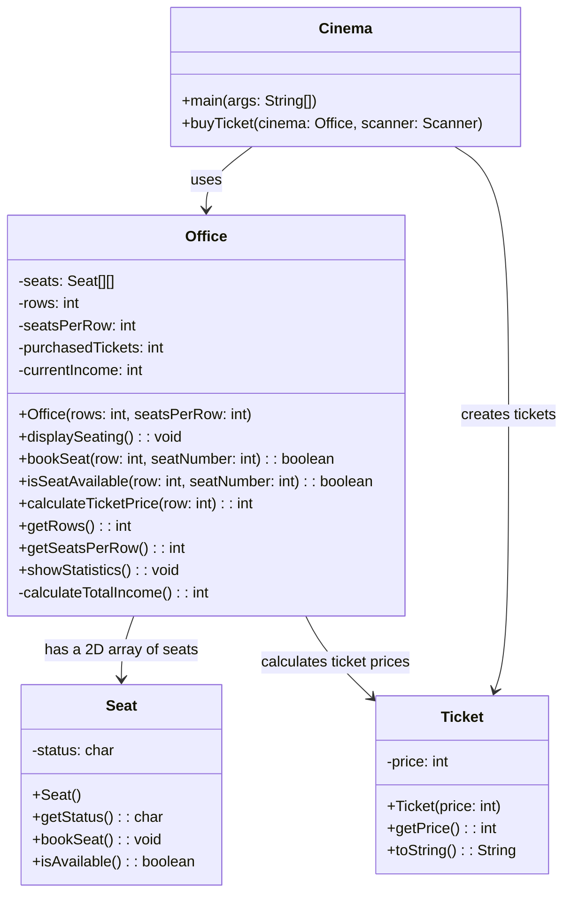

```mermaid
classDiagram
    class Cinema {
        +main(args: String[])
        +buyTicket(cinema: Office, scanner: Scanner)
    }
    
    class Ticket {
        -price: int
        +Ticket(price: int)
        +getPrice(): int
        +toString(): String
    }

    class Office {
        -seats: Seat[][]
        -rows: int
        -seatsPerRow: int
        -purchasedTickets: int
        -currentIncome: int
        +Office(rows: int, seatsPerRow: int)
        +displaySeating(): void
        +bookSeat(row: int, seatNumber: int): boolean
        +isSeatAvailable(row: int, seatNumber: int): boolean
        +calculateTicketPrice(row: int): int
        +getRows(): int
        +getSeatsPerRow(): int
        +showStatistics(): void
        -calculateTotalIncome(): int
    }

    class Seat {
        -status: char
        +Seat()
        +getStatus(): char
        +bookSeat(): void
        +isAvailable(): boolean
    }

    Cinema --> Office : uses
    Office --> Seat : has a 2D array of seats
    Office --> Ticket : calculates ticket prices
    Cinema --> Ticket : creates tickets

```